# install-ubuntu-vnware

# Hướng dẫn cài đặt ubuntu trên máy ảo VMWare

- Nội dung của bài viết xoay quanh việc cài đặt hệ điều hành Linux cụ thể là Ubuntu tùy phiên bản bạn mong muốn, tuy nhiên trong bài viết này mình sử dụng 20.04.6 live server. Các file cài đặt link, key mình sẽ đính kèm trong bài viết nên bạn có thể thực hiện từng bước để cài đặt.

- Trước hết mình mong muốn các bạn có thể tuân thủ các quy tắc được đề ra ☑️:
    + Hãy đặt câu hỏi đúng vị trí
    + Bài viết có thể coppy nhưng hy vọng các bạn ghi nguồn 😘 

# Cài đặt VMWare 
- Các bạn tải tại [VMWare](https://devopsedu.vn/wp-content/uploads/2024/02/vmware-workstation-16.zip)
- Hoặc có thể tải tại các nguồn khác.
- Sau khi tải xong truy cập vào phần: *Help > Enter a License Key > (nhập thử các key có trong file tải)*
- Hình ảnh minh họa:
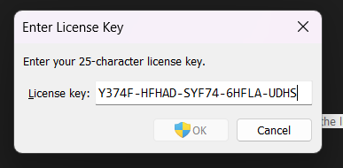

# Cài đặt Ubuntu
- Các bạn có thể chọn các phiên bản khác, ở đây mình sử dụng *Ubuntu 20.04.6 live server*.
- Và mình sử dụng file **.iso** nên có thể sẽ khác với một số bạn cài cách khác.
- Các bạn tải hệ điều hành tại link sau: [Ubuntu](https://drive.google.com/file/d/1afGhYZxcZ27dg5sZp3pkB3O4E02L6YI7/view?usp=sharing)

- Sau khi cài đặt các bạn lựa chọn mạng cấu hình cho máy ảo:
    + Bridge: Giúp các máy trong cùng mạng kết nối với nhau - Khuyến cáo cho **Máy tính bàn**
    + NAT: Máy ảo chỉ chạy trên một máy mình máy bạn - Khuyến cáo cho **Laptop**

- Chọn vào file, hoặc tại màn hình chính VMWare chọn vào thêm máy ảo:
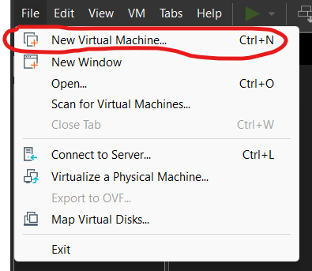

***Lưu ý:*** Các bạn nhớ giải nén toàn bộ file và đặt tại 1 thư mục cụ thể

- Sau đó các bạn có thể làm theo các bước:
## Bước 1: Nhấn "Next":
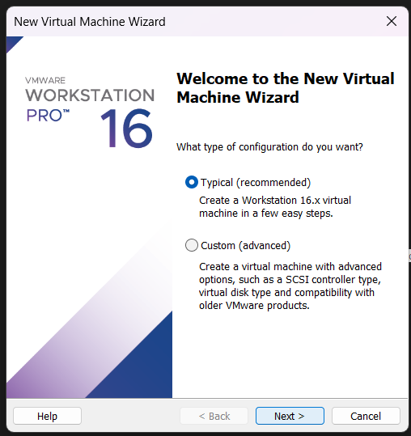

## Bước 2: 
+ Chọn vào mục lựa chọn *.iso*:
    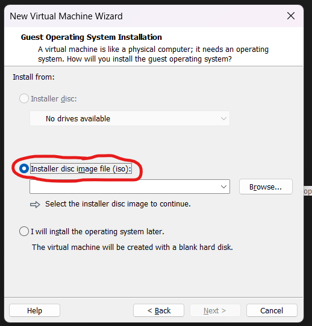
+ Nhấn vào "Browse", chọn tới vị trí đã đặt file ubuntu giải nén:
    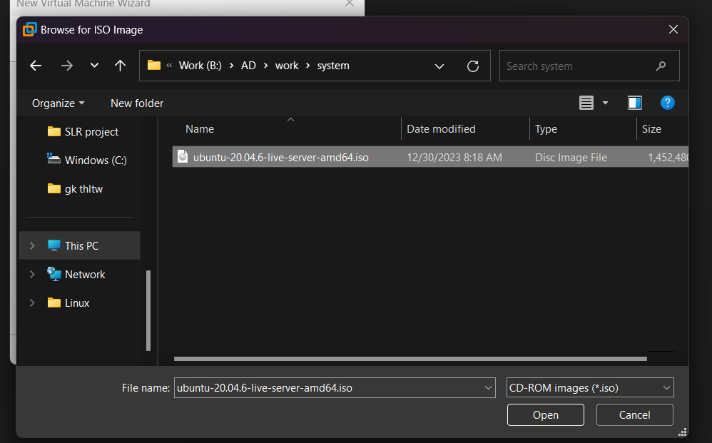
+ Nhấn "Next"

## Bước 3: Nhập các thông tin cho người dùng máy ảo này
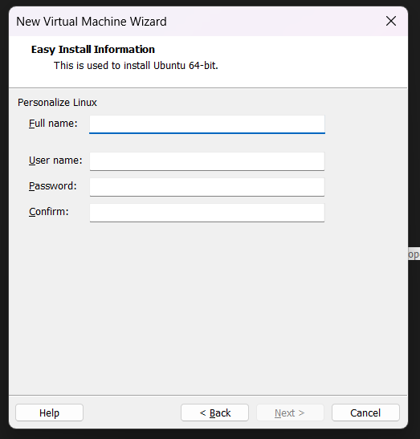 

## Bước 4: Thông tin cho máy ảo

## Bước 5: Cấu hình thông tin đĩa lưu trữ
+ Ở đây mình khuyến cáo các bạn nên để 20gb, hoặc các bạn máy yếu có thể đề từ 10gb đến 15gb 
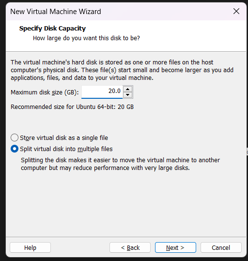

## Bước 6: Kiểm tra và điều chỉnh thông tin phần cứng
+ Mặc định mạng được lựa chọn là NAT nên nếu các bạn để nguyên và nhấn "Next" thì cũng được
+ Mình sẽ hướng dẫn cấu hình chi tiết các bạn theo hướng trên có thể bỏ qua nha:
+ Các bạn nhấn vào "Customize Hardware..."
    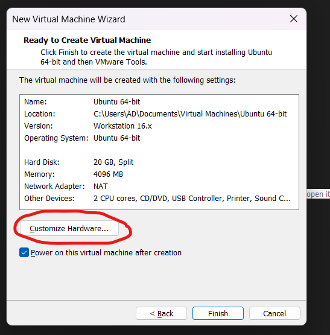
+ Giao diện hiện lên như sau:
    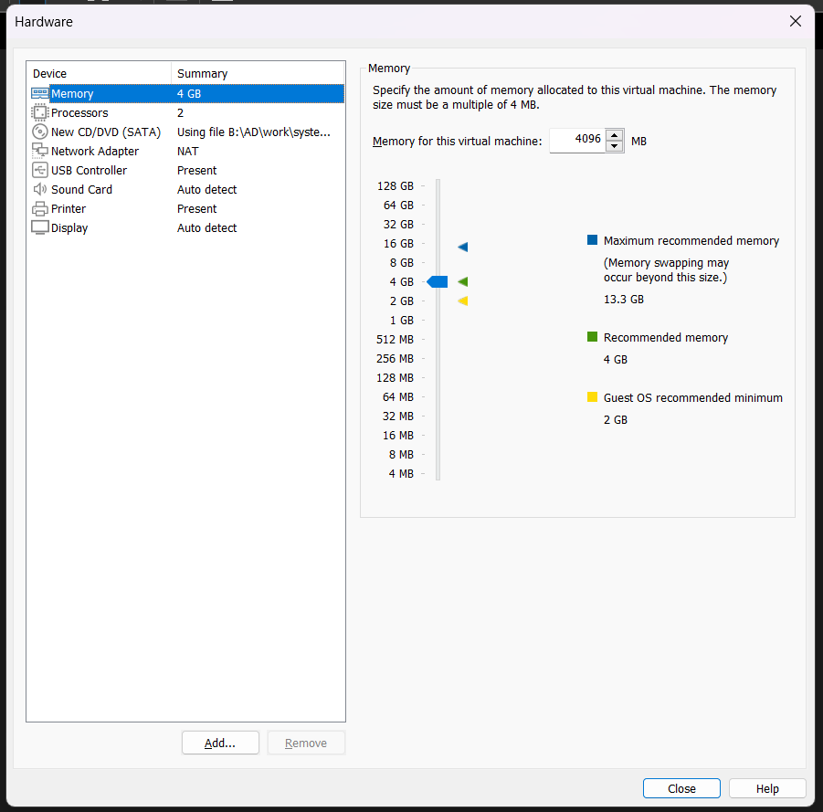
+ Tại phần "Network Adapter" mình sẽ lựa chọn giữ nguyên *NAT*
    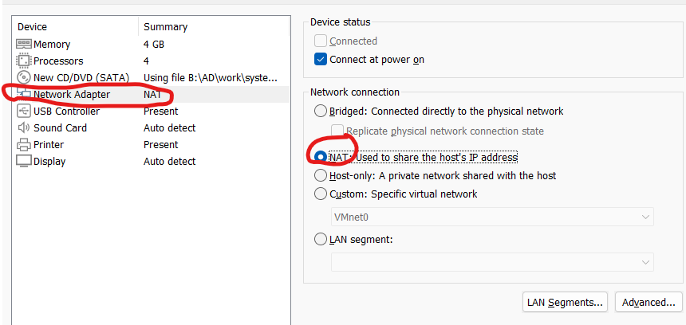
+ Rồi các bạn nhấn vào phần "Close"
+ Sau đó nhấn "Finish"

## Bước 7: Cài đặt cho máy ảo
***Lưu ý:*** Sử dụng các phím *mũi tên* để lựa chọn option, sử dụng *tabs* để chọn tính năng, *enter* để nhấn đồng ý lựa chọn
    + Sau khi máy ảo được khởi động
        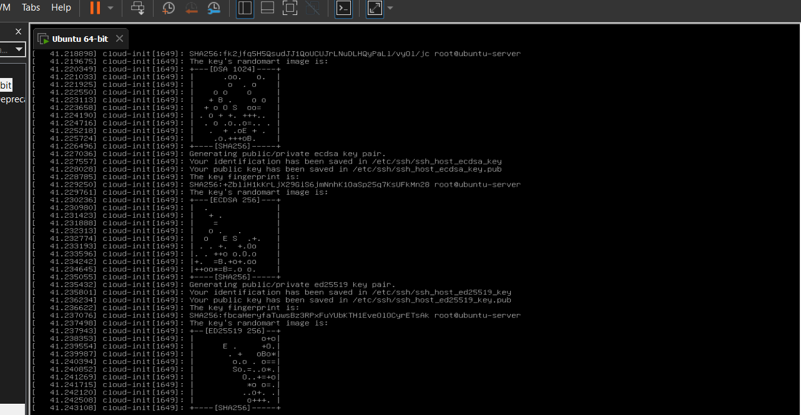
    + Lựa chọn ngôn ngữ, mình sử dụng "English"
        
    + Lựa chọn update, phần này thì tùy cá nhân bạn nhưng với mình thì mình sẽ lựa chọn không update, chọn "Continue without updating" và nhấn *enter*
        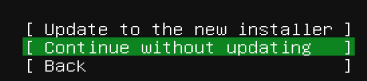
    + Tiếp đến nhấn *enter* cho tới khi gặp màn hình phía dưới
        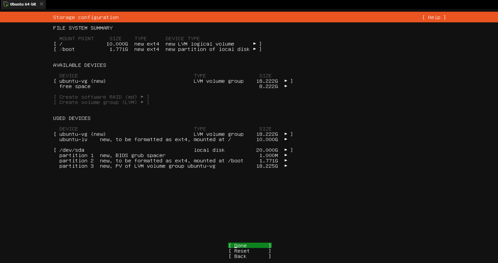
    + Các bạn nhấn *phím lên* tới phần này
        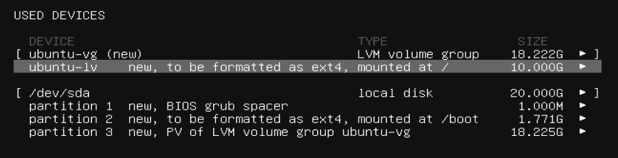
    + Nhấn *enter* chọn vào *edit*
        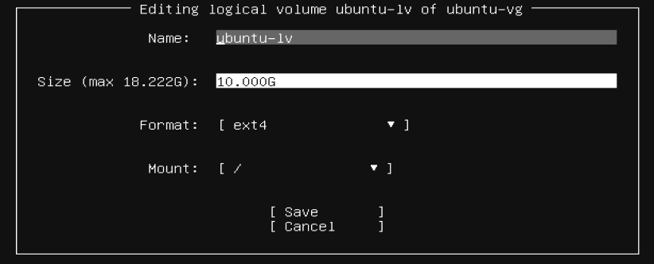
    + Nếu lúc đầu các bạn lựa chọn ***20gb*** thì lúc này hãy nhập 18.222 còn các bạn khác có thể xem không gian còn lại và nhập nó
        
    + Nhấn "Done" và chọn "Continue"
        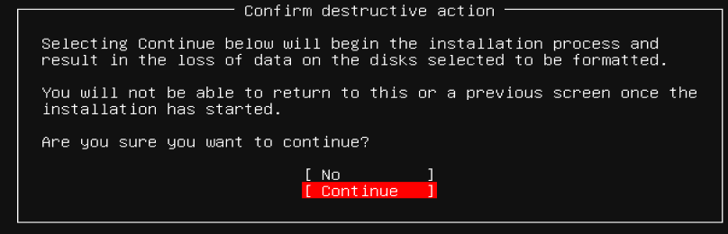
    + Nhập các thông tin giống ban đầu hoặc tùy bạn custome:
        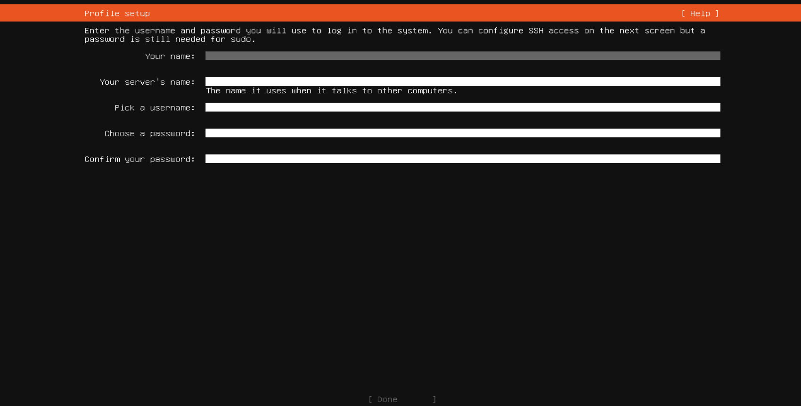
    + Tại mục kế tiếp bạn chọn vào "Install OpenSSH Server"
        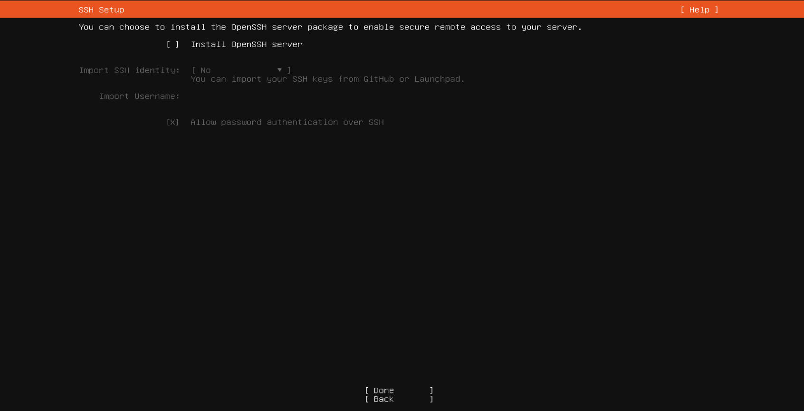
    + Tiếp đó nhấn "Done" tại các màn hình khác cho tới khi gặp màn hình tải
        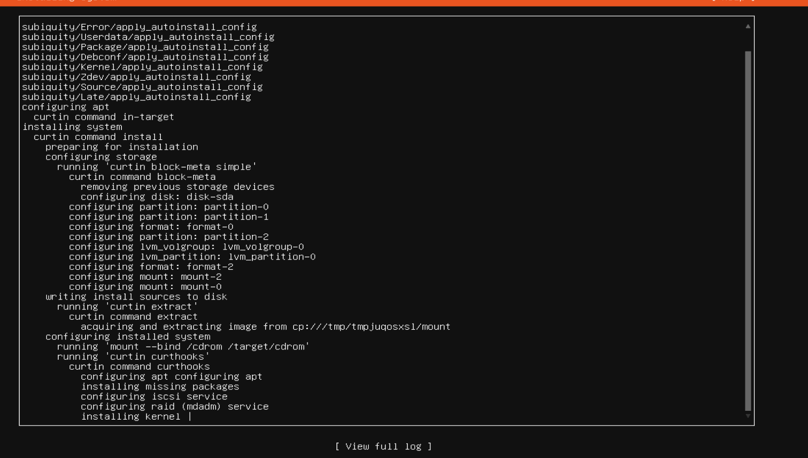
    + Khi thấy màn hình hiển thị việc cancel cho update bạn nhấn vào
        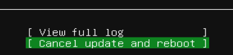
    + Sau đó bạn chờ cho quá trình cài đặt hoàn tất
    + Tiến hành nhập các thông tin đăng nhập
        
    + Các bạn chú ý địa chỉ ip ở dòng này
        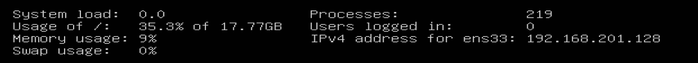
    + Sử dụng Terminal trên windown, nhập lệnh sau và thay thế theo các thông tin bạn đã nhập
        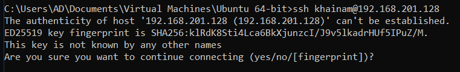
    + Nhập "Yes" sau đó nhập mật khẩu
        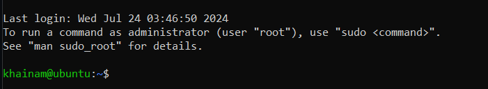
    + Nhập lệnh `sudo -i` để truy cập vào root 
        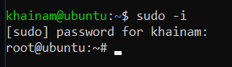

## Bước 8: Sửa wifi sang tĩnh để tránh tình trạng cài đặt lại
+ Bạn mở lại VMWare vào phần **Edit > Virtual Network Editor**
+ Lựa chọn vào mục 2 vào chọn *NAT Setting*
    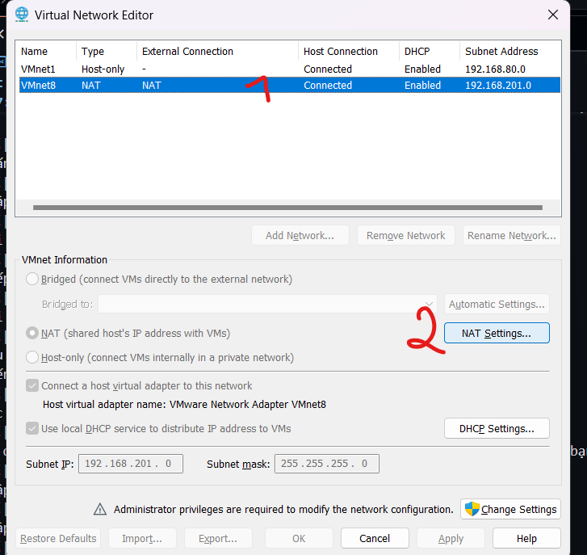
+ Chú ý vào phần địa chỉ ip này
    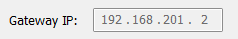
+ Mở terminal trên win, nhập lệnh chỉnh sửa
    `vi /etc/netplan/00-installer-config.yaml`
    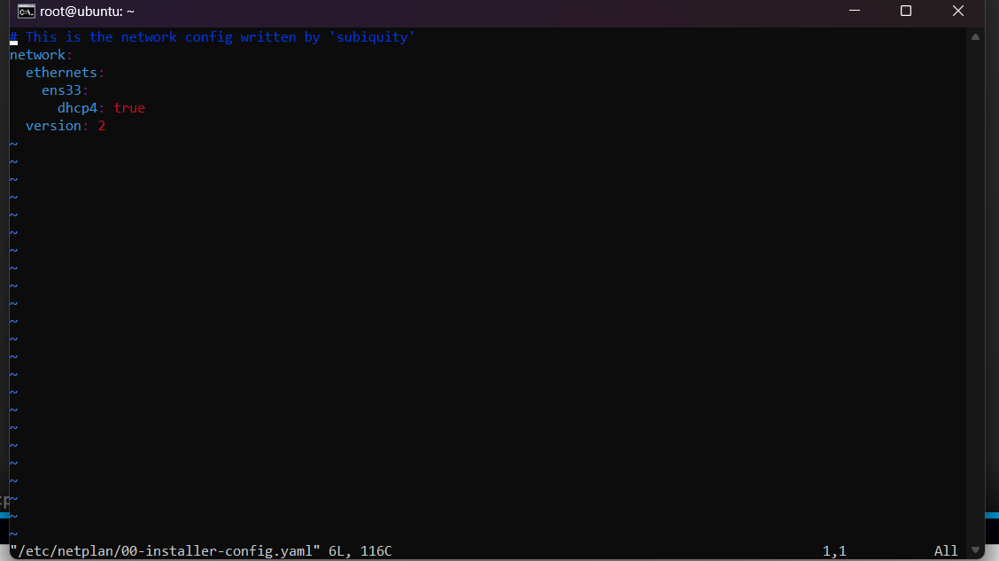
+ Nhấn "i" và sửa thông tin tương ứng thành:
    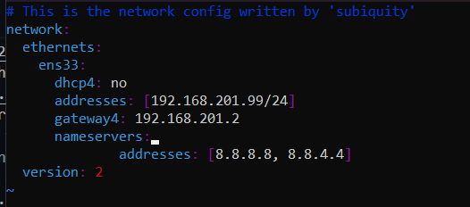
+ Nhấn "esc" sau đó nhập ":x" để lưu lại và thoát
+ Sau đó nhập lệnh để áp dụng
    `netplan apply`
+ Tiến hành thử connect lại với ubuntu bằng terminal của win
    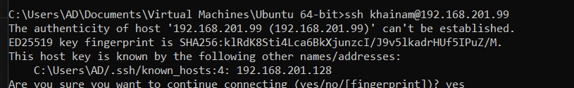

### -- Vậy là đã kết thúc quá trình thiết lập ubuntu --    
